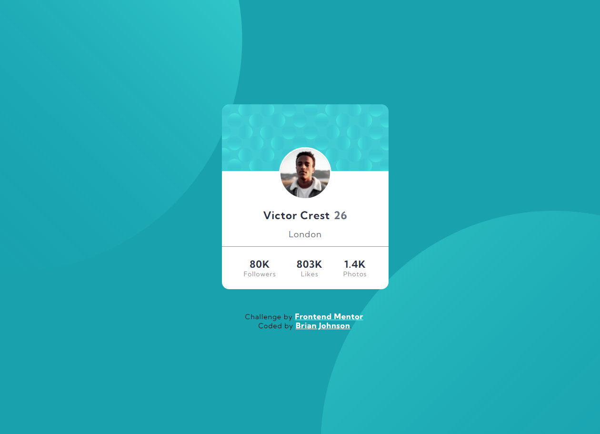

# Frontend Mentor - Profile card component solution

This is a solution to the [Profile card component challenge on Frontend Mentor](https://www.frontendmentor.io/challenges/profile-card-component-cfArpWshJ). Frontend Mentor challenges help you improve your coding skills by building realistic projects.

## Table of contents

- [Frontend Mentor - Profile card component solution](#frontend-mentor---profile-card-component-solution)
  - [Table of contents](#table-of-contents)
  - [Overview](#overview)
    - [The challenge](#the-challenge)
    - [Screenshot](#screenshot)
    - [Links](#links)
  - [My process](#my-process)
    - [Built with](#built-with)
    - [What I learned](#what-i-learned)
    - [Continued development](#continued-development)
    - [Useful resources](#useful-resources)
  - [Author](#author)
  - [Acknowledgments](#acknowledgments)

## Overview

Create a single profile card component in my aim to establish a solid HTML layout stratgey for future projects.

### The challenge

- Build out the project to the designs provided and figure out how to properly layout background images and make them responsive.

### Screenshot



### Links

- Solution URL: [FEM Solution Link](https://www.frontendmentor.io/solutions/truly-responsive-profile-card-component-using-css-properties-F1BCe4vls)
- Live Site URL: [Deployed Project Link](https://brianj-27.github.io/profile-card-component/)

## My process

Again my work process is work the way to layout the HTML. Then the appropriate BEM css classnames and style the components as DRY as possible

### Built with

- Semantic HTML5 markup
- CSS custom properties
- Flexbox
- CSS Grid
- Mobile-first workflow

### What I learned

The major things I learned in this project was how to add multiple background images styling to the project on different screen sizes. I honestly thought I could write this code out once in mobile mode first and not have to worry about making it flexible but turns out I did.

Initially I had this coded with h3 and p tags but found out based on this design, it makes more sense semantically to use an unordered list an put place strong tags on the first child li element in each ul tag.

```html
<div class="card__footer">
  <ul>
    <li><strong>80K</strong></li>
    <li class="card__stats">Followers</li>
  </ul>
  <ul>
    <li><strong>803K</strong></li>
    <li class="card__stats">Likes</li>
  </ul>
  <ul>
    <li><strong>1.4K</strong></li>
    <li class="card__stats">Photos</li>
  </ul>
</div>
```

I am proud of this piece of code because I used the background shorthand to add multiple background images into the layout

```css
@media only screen and (min-width: 768px) {
  body {
    background: url(../images/bg-pattern-top.svg) no-repeat bottom 450px
        left -350px, url(../images/bg-pattern-bottom.svg) no-repeat top 250px
        right -250px, var(--dark-cyan);
  }
}
@media only screen and (min-width: 1200px) {
  body {
    background: url(../images/bg-pattern-top.svg) no-repeat bottom 350px
        left -150px, url(../images/bg-pattern-bottom.svg) no-repeat top 450px
        right -50px, var(--dark-cyan);
  }
}
```

### Continued development

I want to make sure I have a solid understanding of containers and making sure I place components perfectly center on the page for these types of projects. Also I feel like the background image issue I had can be improved upon for future projects.

### Useful resources

- [CSS Multiple Backgrounds](https://www.w3schools.com/css/css3_backgrounds.asp) - This helped me figure out to use multiple css backgrounds.

## Author

- Website - [Brian Johnson's Portfolio](https://brianbjohnson.net/)
- Frontend Mentor - [FEM PRofile Page](https://www.frontendmentor.io/profile/BrianJ-27)

## Acknowledgments

I want to give a shoutout to Grace on this project. She really helped me make key adjustments to my HTML layout and advised me that my component was touching the sides of the screen on smaller screen sizes so I made the adjustments per her guidance
